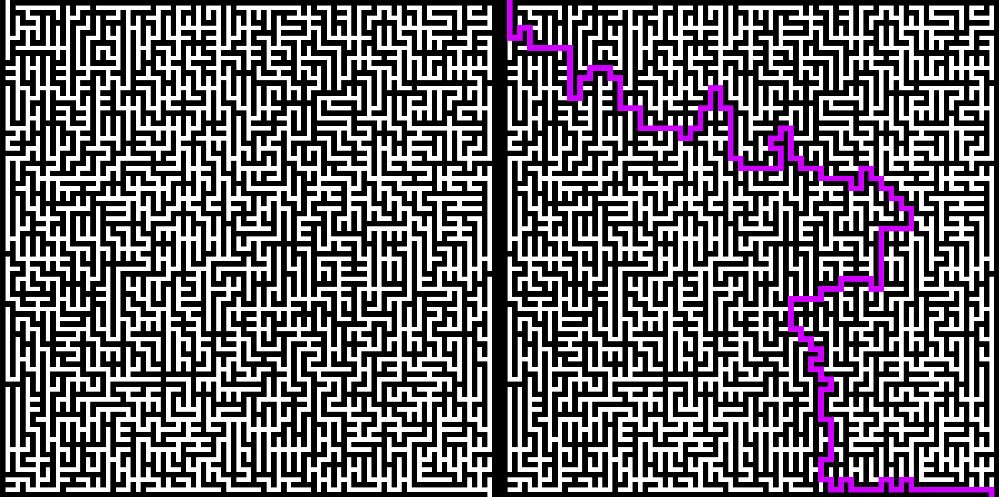

# Консольная утилита для генерации и решения лабиринтов

Лабиринт генерируется по алгоритму Эллера. Решение происходит по рекурсивному best-first search.

Поддерживает:

- Возможность указывать размеры лабиринта со стенками (нечётное число, > 3)
  - Из-за рекурсивного метода решения слишком большие размеры не поддерживаются
- Генерацию и решение лабиринта, вывод на экран
- Сохранение изображения нерешённого лабиринта
- Сохранение лабиринта в текстовом формате
- Загрузку лабиринта из текстового формата

## Примеры использования:

Генерация и решение лабиринта, вывод на экран:

`python main.py --cols 33 --rows 33 --show`

Генерация и решение лабиринта, вывод на экран и сохранение изображения:

`python main.py --cols 33 --rows 33 --show --image`

Генерация и решение лабиринта, вывод на экран и сохранение в текстовом формате:

`python main.py --cols 33 --rows 33 --show --text`

Генерация и решение лабиринта, вывод на экран и сохранение в обоих форматах с указанием имени:

`python main.py --cols 33 --rows 33 --show --image --text --name my_maze`

Загрузка из текстового файла и решение лабиринта, вывод на экран (поддерживаются и методы сохранения):

`python main.py --import test.txt --show`
